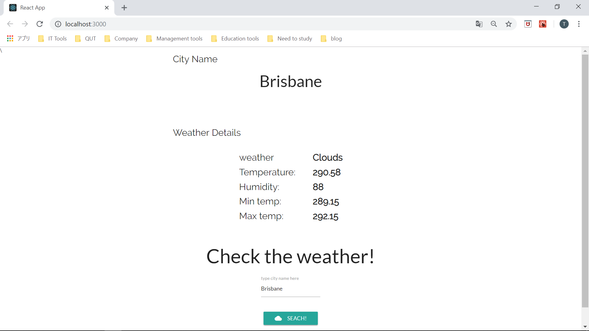

# Weather checker

Practice application project created with React.

You can search any city you want, and get weather information:)



# Requrement

You require [npm](https://nodejs.org/en/) to use this application.

# Setup

## Install

```
git clone github.com/TaigaMatsumoto/weather_checker.git
cd weather_checker
npm install
```

## Run

Run command below

```
npm start
```

As a default, the application runs on port 3000 so go to http://localhost:3000/

# Usage

This app is made for practice purpose. You can try my weather app:)
